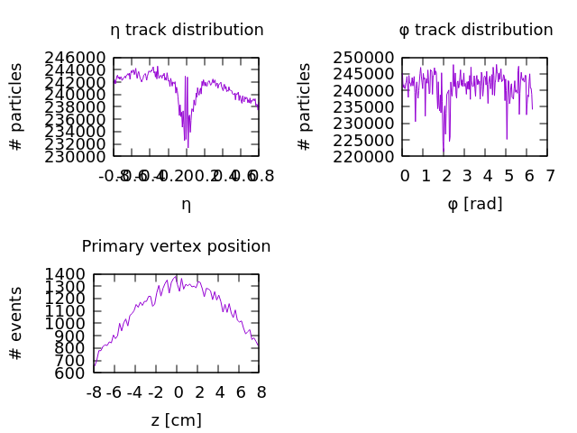

# ALICE-rs #
**This is not an official ALICE or CERN project**


This repository demonstrates how the [public data](http://opendata.cern.ch/collection/ALICE-Reconstructed-Data) released by the CERN based ALICE collaboration can be analyzed with the Rust programming language.

Here are some (not pretty) example figures produced with this project. The first two show the distribution of produced particles in the longitudinal and azimuthal dimensions. The third figure shows where the collisions took place along the direction of the particle beams in the collider:



This collection of crates provides and demonstrates:
* A [parser](https://github.com/cbourjau/alice-rs/tree/master/root-io) for reading the [ROOT](https://root.cern.ch/) binary file format. This is the standard format used in particle physics.
* The [mALICE](https://github.com/cbourjau/alice-rs/tree/master/malice) framework providing some essential tools for writing an analysis of the public data.
* A library/binary for downloading a desired amount of the publicly released data. See the [alice-download](https://github.com/cbourjau/alice-rs/tree/master/alice-download) crate. The [alice-open-data](https://github.com/cbourjau/alice-rs/tree/master/alice-open-data) crate provides some conveniences for later locating and reading the downloaded files
* High performance n-dimensional histograms for streaming data.
  Maintains a binned count of the data which can be successively filled. See [histogram](https://github.com/cbourjau/alice-rs/tree/master/histogram)
* **A  simple analysis demonstrating how it all plays together. See [simple-analysis](https://github.com/cbourjau/alice-rs/tree/master/examples/simple-analysis)**

## Dependencies

There are no dependencies on any ALICE specific software, nor ROOT itself. 

## CERN, LHC, and ALICE

ALICE (A Large Ion Collider Experiment) is the dedicated Heavy Ion experiment at the Large Hadron Collider (LHC) in Switzerland. Just like most other CERN based experiments, its goal is to better understand the fundamental particles and forces of the universe. In particular, ALICE is concerned with the so called strong force which is the dominant actor for processes within an atomic nuclei. Many of the properties of this force manifest them self at extreme pressures and temperatures as they were found micro seconds after the Big Bang. By colliding heavy nuclei such as lead ions at nearly the speed of light, we are able to recreate such extreme conditions for a very brief moment within the ALICE detector. By carefully studying the particles produced at such collisions we can deduce the properties of the strong force which will help us to better understand nuclear reactions, neutron stars, the first moments of the universe and much more.

## CERN open data

ALICE, as well as some other CERN based experiments have released a small subset of their recorded data into the public domain. The dataset in question for this project is in total approximately 6TB. While some analyses really need all the data they can get, others (like the example one) can be run on just a ~1GB. With this project it is perfectly feasile to download the complete public dataset to a large external hard drive and run a complex analysis over night on a laptop.

## Performance

The [standard implementation]((https://root.cern.ch/)) for reading ROOT files is written in C++. I wrote a [wrapper](https://github.com/cbourjau/alice-sys) to interface with the standard implementation to do exactly the same kind of work which is being done in the Rust code. I ran both implementations on exactly the same set of input files. The results were identical in both cases. I once ran with a warm cache and once with a cold one. The benchmarks were done with [`hyperfine`](https://github.com/sharkdp/hyperfine). Below are the results:

- Warm cache
``` bash
$ hyperfine --warmup=1 './target/release/deps/malice-0650b02bfc3cb85f bench_rust' './target/release/deps/malice-0650b02bfc3cb85f bench_cpp'
Benchmark #1: ./target/release/deps/malice-0650b02bfc3cb85f bench_rust

  Time (mean ± σ):      6.305 s ±  0.187 s    [User: 5.392 s, System: 0.909 s]
 
  Range (min … max):    6.156 s …  6.788 s
 
Benchmark #2: ./target/release/deps/malice-0650b02bfc3cb85f bench_cpp

  Time (mean ± σ):      8.234 s ±  0.116 s    [User: 6.888 s, System: 1.347 s]
 
  Range (min … max):    8.098 s …  8.406 s
```

- Cold cache

``` bash
$ hyperfine -p 'sync; echo 3 | sudo tee /proc/sys/vm/drop_caches' './target/release/deps/malice-0650b02bfc3cb85f bench_rust' './target/release/deps/malice-0650b02bfc3cb85f bench_cpp'
Benchmark #1: ./target/release/deps/malice-0650b02bfc3cb85f bench_rust

  Time (mean ± σ):     10.894 s ±  0.180 s    [User: 6.750 s, System: 1.348 s]
 
  Range (min … max):   10.619 s … 11.213 s
 
Benchmark #2: ./target/release/deps/malice-0650b02bfc3cb85f bench_cpp

  Time (mean ± σ):     18.557 s ±  0.464 s    [User: 8.519 s, System: 2.691 s]
 
  Range (min … max):   17.775 s … 19.156 s

```

In both cases, the Rust version processed the set of files ~30% (warm cache) and ~70% (cold cache) faster. The cold catch is arguably the more realistic bench mark since one will visit each file in a set only once per analysis. Note that these benchmarks used no concurrency at all. The real value of the Rust version is that it can easily be used multithreaded, while the ROOT-implementation cannot.

Note also, that the standard ALICE framework, which is build on top of ROOT, was not benchmarked. The ALICE framework always reads in and decompresses all the data of a given file, even though a normal analysis only needs to access less then 10% of it. This makes the standard ALICE framework significantly less performant than this set of crates.

<!-- ### Having a parallel io thread with a FIFO buffer -->
<!-- In the standard framework, each collision is read in from disk and processed sequentially. ALICE-rs does these two things in separate threads using `chan`'s MPMC model which even comes with a buffer finite buffer. This is something which I would have dreaded to do in c++. In Rust it turned out to be a piece of cake in Rust. -->

<!-- ### A high performance n-dimensional histogram -->
<!-- Another performace boost This project also implements an n-dimensional histogram, which appears to be significantly faster than ROOT's alternative. This becomes especially important if a histogram has to be filled in nested loops (which is the case in the example analysis). -->


## Why this project?

I started this project with the intend of learning the Rust programming language. It did not take long until I was plainly fascinated by its ease of use, all the little gems like the debug formatting of bitflags, and the never the less uncompromising speed. 

In the mean time I was able to strip of more and more dependencies to the ALICE software stack (aka. [AliRoot](https://github.com/alisw/AliRoot) and [AliPhysics](https://github.com/alisw/AliPhysics)). Finally I reached the point where I was able to drop all of the ~5M lines of code.
I realized that this project might be of interest to a wider group of people who would like to use the ALICE public data but are understandably lost in the ALICE software stack. Currently, the only way to analyze the published data is through that huge and largely undocumented ALICE framework, which I consider an almost insurmountable entry barrier. Even if somebody does not want to learn Rust, this repository might still provide valuable clues on how to analyze ALICE's data with minimal dependencies.

Perhaps not surprisingly, removing so much code and indirection from the analysis improved the performance significantly. 

