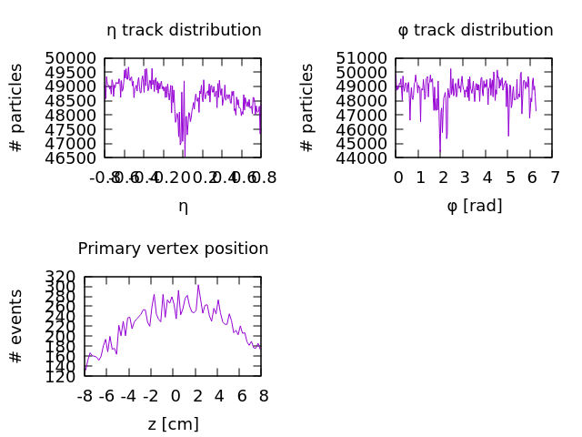

# simple-analysis
This crate demonstrates how all the other parts work together.
The stream of event coming from the IO processes is split up into `M` parallel streams (each stream being a `Dataset` by itself).
Each of these `M` streams is processed in its own thread.
The processing of one stream is seen in the function `single_distribution_analysis` in `main.rs`.
The very first step of every analysis is the validation of the event. Oftentimes, one is only interested in event which fulfill very particular criteria. In this case, we just use a set of standard criteria (`cuts` in particle physics lingo) provided by the `alice` crate.

Every event produced many 100s or 1000s of particles. These particles traversed the detector and were reconstructed as good as possible. Each of these reconstructions is called a `Track`.
For some tracks, the reconstruction worked really well, while some might have a very poor uncertain fit to the signals seen by the detector. Thus, one usually performs a filtering on the quality of these tracks in order to remove "badly" reconstructed trackrs or tracks which originated from a different nearby collision in the detector. This example analysis again uses default cuts provided by the `alice` crate.

Lastly, we fold over all validated events using our analysis.

This concludes the treatment of a single stream of events. However, as noted above, we want to do this on `M` streams in parallel (Truth be told, currently `M` is hard-coded to 4, but that will be fixed soon). The steering of the entire analysis is done in the `main` function. First we locate the local files with the `alice_open_data` crate. Then we instantiate a new `Dataset` from these files using `2` io threads.
We then `install` the logic of how to analyze a single stream (`single_distribution_analysis`) into the `Dataset`. The `Dataset` will take care of the parallelization and will return us merged results.

Lastly, we visualize the results using the `gnuplot-rs` crate. Usually, one would want to do more sophisticated post-processing on the histograms; usually in numpy. But making figures out of Rust has a nice feel to it!

The final figure produces is shown below. The top tow figures show the distribution of particles in the longitudinal (`eta`) and azimuthal (`phi`) dimension.
The bottom figure shows the distribution of where exactly the collision took place within the detector. Namely, The collisions may be slightly displaced from the center of the detector along the beam axis.

